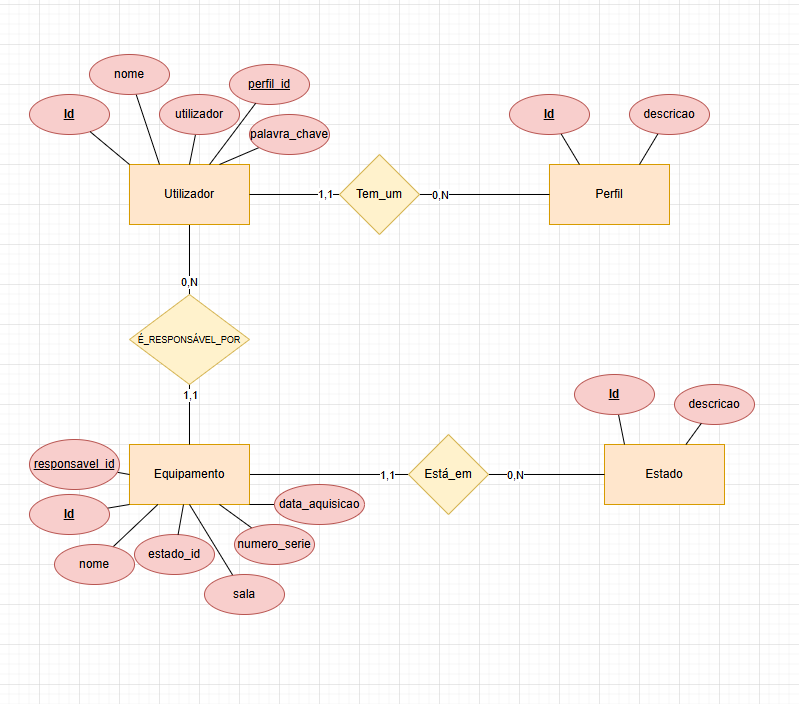
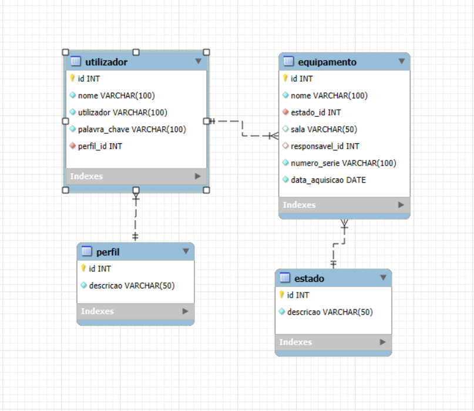

# 📦 JavaTech Equipamentos

Projeto final da UFCD 0816 – Programação de Sistemas Distribuídos em Java.

**Equipa:**  
Hugo Hall Pereira, José Loureiro Dias, Marcos Matos Silva, Maria Izadora Alcântara, Tayara Gomes da Cruz  
**Formador:** Nuno Luís Rodrigues Aleixo Silva  
**Data:** Julho de 2026

---

## 📋 Descrição do Projeto

O **JavaTech Equipamentos** é um sistema de gestão de equipamentos de uma empresa fictícia. Permite o controlo completo do ciclo de vida dos equipamentos: registo, atualização de estado, atribuição de responsáveis e remoção (restrita a administradores).

O sistema foi desenvolvido em **Java**, utilizando **Swing** para a interface gráfica, **MySQL Workbench** para a base de dados e **JDBC** para comunicação entre aplicação e base de dados. Toda a estrutura segue o padrão **MVC**.

---

## 🎯 Funcionalidades Principais

- Login com autenticação por perfil: Administrador, Técnico e Formador
- Registo de novos equipamentos com detalhes completos
- Edição do estado (Ativo, Em Reparação, Reservado)
- Atribuição de responsáveis aos equipamentos
- Filtros por estado e sala
- Remoção de equipamentos (apenas Administrador)
- Interface adaptada ao tipo de utilizador

---

## 👥 Perfis de Utilizador

| Perfil       | Permissões                                                                 |
|--------------|-----------------------------------------------------------------------------|
| Administrador| Inserir, editar, remover, atribuir responsáveis, filtrar, visualizar       |
| Técnico      | Inserir, editar estado, filtrar, visualizar                                |
| Formador     | Apenas visualizar e aplicar filtros                                        |

---

## ⚙️ Tecnologias Utilizadas

- **Java 17+**
- **Java Swing** (interface gráfica)
- **MySQL Workbench** (base de dados)
- **JDBC** (conector entre Java e MySQL)
- **MVC** (Model - View - Controller)

---

## 🧱 Estrutura do Sistema

- `Model` → Entidades e DAOs (acesso aos dados)
- `View` → Interfaces construídas com Java Swing
- `Controller` → Lógica de controlo entre view e model
- `Dao` → DAOs

---

## 🗄️ Modelo de Dados (ER)

> Diagrama Entidade-Relacionamento com as tabelas:
- **Equipamento**
- **Utilizador**
- **Perfil**
- **Estado**

---

## 📐 Diagrama de Classes (UML)

> Representação UML das principais classes do sistema.

---

## 📅 Cronograma de Desenvolvimento

| Sessão      | Atividade                                             |
|-------------|--------------------------------------------------------|
| 00          | Apresentação do curso                                  |
| 01 - 02     | Desenvolvimento FrontEnd com Swing                     |
| 03 - 06     | Implementação da base de dados + Backend (JDBC/DAO)    |

---

## 🖼️ Interface da Aplicação

> Abaixo estão algumas imagens da interface desenvolvida com Java Swing.

🖼️ *[Inserir aqui screenshot da tela de login]*  
🖼️ *[Inserir aqui screenshot do registo de equipamento]*  
🖼️ *[Inserir aqui screenshot da listagem ]*

---

## 🛠️ Requisitos Técnicos

- Java JDK 17+
- MySQL Server e Workbench instalados
- Driver JDBC adicionado ao classpath
- IDE (como IntelliJ IDEA, Eclipse ou NetBeans)

---

## 📎 Observações Finais

Este projeto foi desenvolvido com foco em boas práticas de programação, reutilização de código, modularidade e organização seguindo o padrão MVC. Está preparado para futuras evoluções e melhorias.

---

